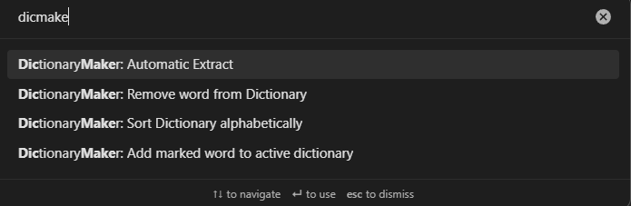
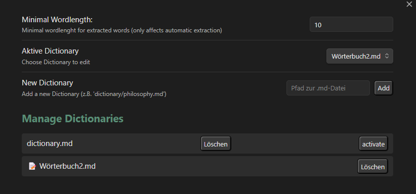

# Dictionary Manager

Plugin to *complement* the *various-complements* plugin amd make it easier to manage your custom dictionaries.

- You can define a minimum number of letters so that only long words are extracted for your dictionary, or 
- add/remove entries manually to/from 
- multiple dictionaries 
- sort the dictionary alphabetically.

## Commands: 

## Settings: 

**various-complements:**
https://github.com/tadashi-aikawa/obsidian-various-complements-plugin

