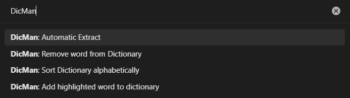

# Dictionary Manager

Plugin to make it easier to manage your dictionaries, used e.g. with the *various-complements* plugin.

- You can define a minimum number of letters so that only long words are extracted for your dictionary, or 
- add/remove entries manually to/from 
- multiple dictionaries 
- sort the dictionary alphabetically.

## Commands: 

## Settings: 

